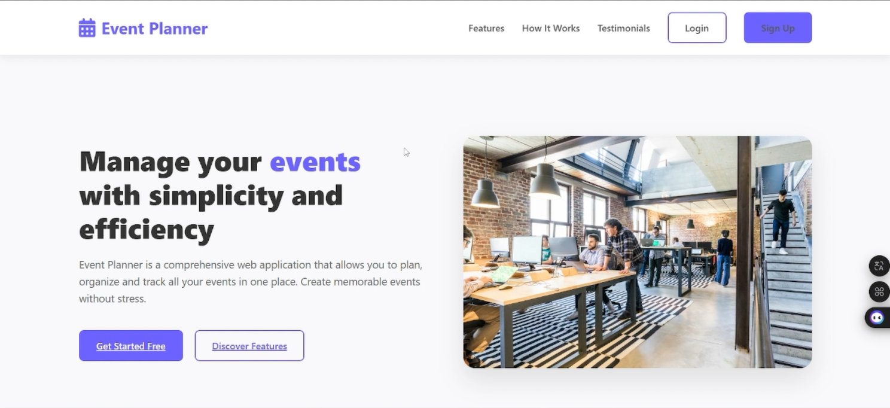
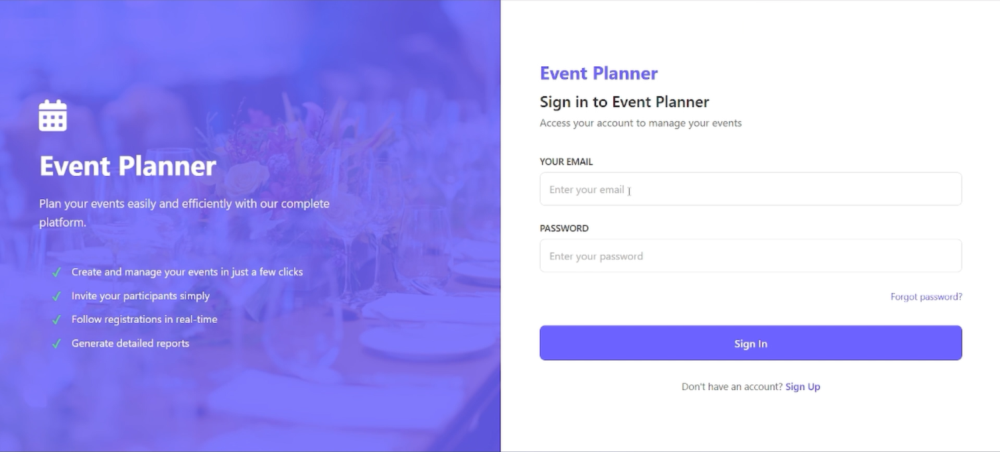
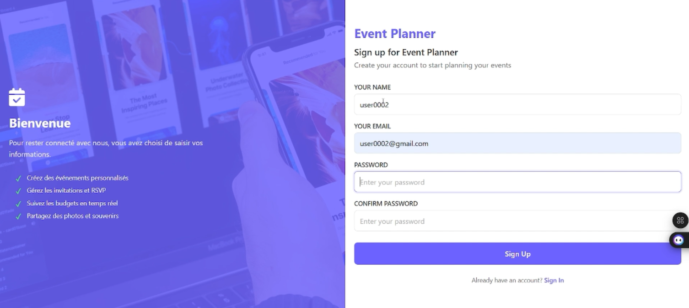
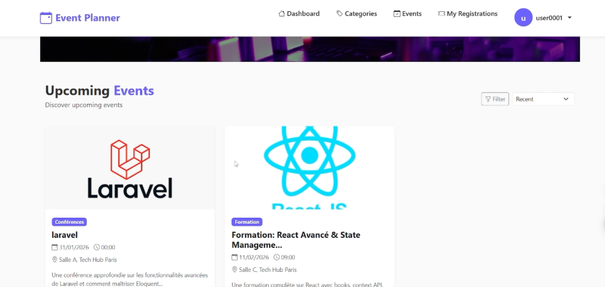
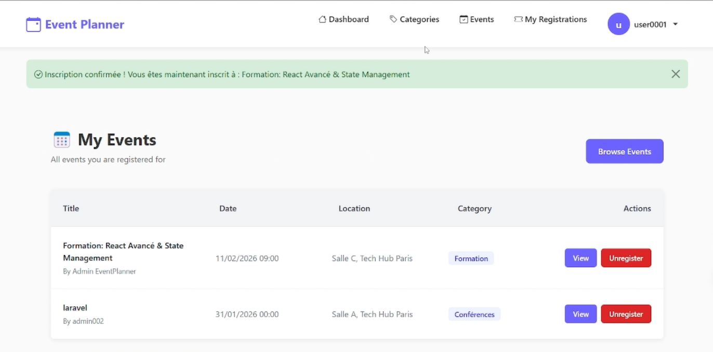
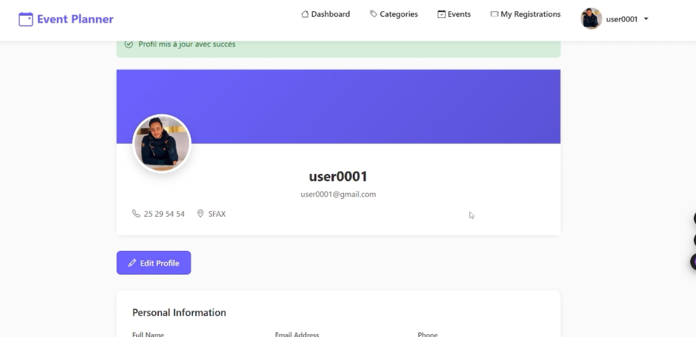
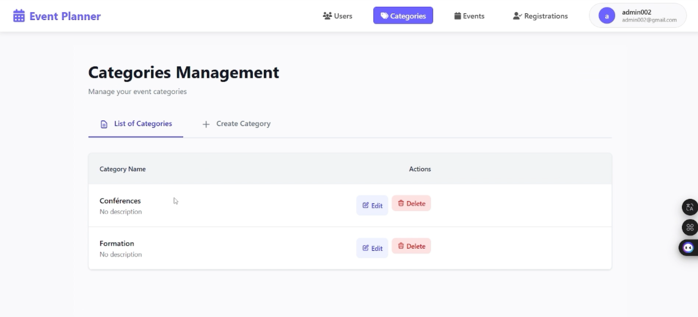
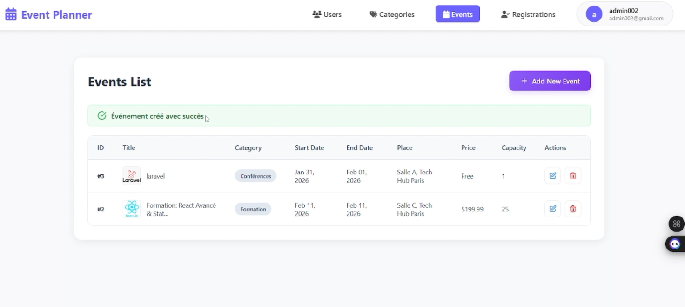
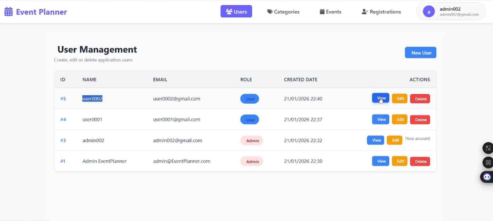
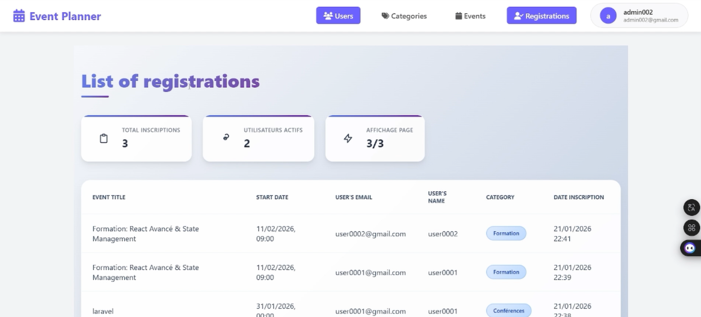

# 📅 EventPlanner

### Full-Stack Event Management Platform built with Laravel 12

EventPlanner is a full-stack web application designed to manage **events, categories, users, and event registrations** through separate workflows for administrators and participants.

The application is built with **Laravel 12**, **PHP 8.2**, **MySQL**, **Eloquent ORM**, **Blade**, and **Bootstrap**, and demonstrates a traditional Laravel MVC architecture with session-based authentication and custom role middleware.

---

## 🎥 Demo

A complete walkthrough of the main EventPlanner workflows is available here:

[](https://drive.google.com/file/d/1n4wYXKcO70Brjbpre_zxXekASekbVXlZ/view?usp=drive_link)

### Demo includes

- Landing page
- User registration
- User login
- Event browsing
- Event registration
- Personal registrations
- Event unregistration
- User profile
- Admin category management
- Admin event management
- Admin user management
- Admin registration overview


---

# 📸 Screenshots

## 🏠 Landing Page

The public landing page introduces the platform and provides access to authentication and registration.



---

## 🔐 Authentication

### Login

Users authenticate through Laravel's session-based authentication system.



### Registration

New participants can create an account through the public registration interface.



---

# 👤 Participant Experience

## Upcoming Events

Authenticated users can browse available approved events and view information such as:

- Event title
- Category
- Date
- Location
- Price
- Capacity
- Description



---

## My Events

Participants can view the events they are currently registered for.

From this interface, they can:

- View event details
- See the event category
- Check the event date and location
- Cancel their registration



---

## User Profile

The application includes a dedicated participant profile interface displaying personal account information.



---

# 🛡️ Administration Interface

## Category Management

Administrators can manage event categories through CRUD operations.



---

## Event Management

Administrators can create, edit and delete events while managing information such as:

- Title
- Category
- Start date
- End date
- Location
- Price
- Capacity
- Event image



---

## User Management

Administrators have access to centralized user management.

The interface supports:

- Viewing users
- Creating users
- Editing users
- Deleting users
- Viewing user roles



---

## Registration Overview

Administrators can monitor event registrations across the platform.

The registration view provides information about:

- Registered users
- User email addresses
- Event titles
- Categories
- Registration dates
- Total registrations
- Active users



---

# ✨ Features

## 👤 Participant Features

Participants can:

- Create an account
- Log in and log out
- Browse event categories
- Browse approved events
- View event details
- Register for an event
- Avoid duplicate registrations
- View personal registrations
- Cancel an existing registration
- Access their profile

---

## 🛡️ Administrator Features

Administrators can:

- Access protected admin routes
- Manage categories
- Create, edit and delete events
- Upload event images
- Update event images
- Manage users
- View individual users
- Create and edit users
- Delete users
- Monitor registrations
- Search registration information

---

# 🎟️ Event Registration Workflow

The participant registration workflow is handled directly through Laravel controllers and Eloquent models.

```text
User
 │
 ▼
Browse Approved Events
 │
 ▼
Open Event Details
 │
 ▼
Register
 │
 ├── Authentication Check
 ├── User Role Check
 ├── Duplicate Registration Check
 └── Capacity Check
 │
 ▼
Create Registration
 │
 ▼
Decrease Available Capacity
 │
 ▼
Registration Appears in "My Events"
```

A database-level unique constraint also prevents the same user from registering twice for the same event.

---

# 🔄 Event Unregistration Workflow

Participants can cancel their own event registrations.

```text
My Events
   │
   ▼
Select Registration
   │
   ▼
Confirm Unregistration
   │
   ▼
DELETE Request
   │
   ├── Authentication
   ├── User Role Middleware
   ├── CSRF Validation
   └── Ownership Verification
   │
   ▼
Delete Registration
   │
   ▼
Restore Event Capacity
```

When a registration is removed, the corresponding event capacity is incremented again.

---

# 🏗️ Software Architecture

EventPlanner follows a traditional **Laravel MVC architecture**.

```text
                       Browser
                          │
                          ▼
                    Laravel Routes
                          │
                          ▼
                 Authentication / Role
                       Middleware
                          │
                          ▼
                     Controllers
                    /           \
                   /             \
                  ▼               ▼
          Eloquent Models      Blade Views
                  │               │
                  ▼               ▼
             MySQL DB        Bootstrap UI
```

The project does not use a dedicated Service Layer or Repository abstraction. Business logic is mainly handled directly inside Laravel controllers using Eloquent ORM.

---

# 🧩 Architecture & Design Patterns

## Model-View-Controller — MVC

The project follows Laravel's standard MVC structure.

```text
Model
  → Eloquent ORM

View
  → Blade Templates

Controller
  → Laravel HTTP Controllers
```

---

## Active Record

Laravel Eloquent follows the Active Record approach.

The main models are:

```text
UserBw
CategoryBw
EventBw
RegistrationBw
```

Each model represents a database entity and manages its relationships and persistence operations.

---

## Middleware / Intercepting Filter

Custom middleware separates administrative and participant access.

```text
AdminMiddleware_bw
UserMiddleware_bw
```

The middleware checks both authentication state and user role before allowing access to protected sections.

---

## Front Controller

Laravel uses a centralized HTTP entry point before requests are routed to the appropriate controller.

---

# 🛠️ Technology Stack

| Layer | Technology |
|---|---|
| Language | PHP 8.2+ |
| Backend Framework | Laravel 12 |
| Architecture | MVC |
| ORM | Eloquent ORM |
| Database | MySQL |
| Template Engine | Blade |
| Main UI Framework | Bootstrap 5 |
| Icons | Bootstrap Icons / Font Awesome |
| Authentication | Laravel Session Authentication |
| Authorization | Custom Role Middleware |
| Asset Tooling | Vite |
| Package Management | Composer / NPM |
| Image Storage | Laravel Storage |

The project also contains Tailwind CSS tooling in its frontend dependencies, although the application views primarily use Bootstrap and custom CSS.

---

# 👥 User Roles

EventPlanner supports two roles.

| Role | Main Capabilities |
|---|---|
| `user` | Browse events, view categories, register for events and manage own registrations |
| `admin` | Manage users, categories, events and registration information |

The role is stored in the `users_bw` table.

---

# 🔐 Authentication

EventPlanner uses custom Laravel session authentication.

## Login Flow

```text
Login Form
    │
    ▼
LoginRequest Validation
    │
    ▼
Auth::attempt()
    │
    ▼
Session Regeneration
    │
    ▼
Check User Role
   / \
  /   \
 ▼     ▼
Admin  User
 │      │
 ▼      ▼
Admin   Participant
Area    Area
```

The authentication flow regenerates the session after a successful login.

Passwords are hashed using Laravel's hashing mechanisms.

Public registration automatically creates accounts with the:

```text
user
```

role.

---

# 🔒 Authorization

The application uses custom middleware for role-based access.

## Participant Routes

Protected with:

```text
auth
user
```

Main routes include:

```text
/user/categories
/user/categories/{id}

/user/events
/user/events/{id}

/user/events/{id}/register

/user/my-events

/user/registrations/{id}
```

---

## Administrator Routes

Protected with:

```text
auth
admin
```

Administrative sections include:

```text
/admin/categories
/admin/events
/admin/users
/admin/users/registrations
```

---

# 🗃️ Domain Model

The application contains four main domain models.

```text
UserBw
CategoryBw
EventBw
RegistrationBw
```

## Relationships

```text
UserBw
   │
   └──── hasMany ────► RegistrationBw


CategoryBw
   │
   └──── hasMany ────► EventBw


EventBw
   │
   ├──── belongsTo ──► CategoryBw
   │
   ├──── belongsTo ──► UserBw
   │
   └──── hasMany ────► RegistrationBw


RegistrationBw
   │
   ├──── belongsTo ──► UserBw
   └──── belongsTo ──► EventBw
```

---

# 🗄️ Database Structure

## `users_bw`

Stores application users.

```text
id
name
email
password
role
remember_token
created_at
updated_at
```

Supported roles:

```text
admin
user
```

---

## `category_bws`

Stores event categories.

```text
id
name
created_at
updated_at
```

---

## `event_bws`

Stores events.

```text
id
title
description
start_date
end_date
place
price
is_free
capacity
image
status
category_id
created_by
created_at
updated_at
```

Event status values include:

```text
pending
approved
cancelled
```

---

## `registration__bws`

Stores participant/event registrations.

```text
id
user_id
event_id
created_at
updated_at
```

A unique constraint is applied to:

```text
user_id + event_id
```

to prevent duplicate registrations.

---

# 📦 Event Management

Administrators can perform CRUD operations on events.

```text
Create
Read
Update
Delete
```

Event information includes:

- Title
- Description
- Start date
- End date
- Location
- Price
- Free/Paid flag
- Capacity
- Image
- Category
- Status

New events are created with a default status of:

```text
pending
```

Participant-facing event listings display approved events.

> An explicit dedicated administration workflow for changing an event from `pending` to `approved` is not currently confirmed in the implementation.

---

# 🖼️ Event Image Uploads

Event image upload is implemented in the administrator event management workflow.

Supported formats include:

```text
jpeg
png
jpg
gif
webp
```

Maximum size:

```text
2 MB
```

Files are stored through Laravel's public storage disk.

When an image is replaced during an event update, the previous stored image is removed.

---

# 📂 Category Management

Administrators can:

- List categories
- Create categories
- Edit categories
- Delete categories

Each category can be related to multiple events.

```text
CategoryBw
   │
   └── hasMany
          │
          ▼
       EventBw
```

---

# 👨‍💼 User Management

The administration interface includes dedicated user management.

Administrators can:

- List users
- Create users
- View user details
- Edit user information
- Delete users

The application also contains a protection preventing an administrator from deleting their own active account through the administrative user-management workflow.

---

# 📋 Registration Management

Event registration includes several checks before creating a record.

```text
Authenticated?
      │
      ▼
Correct Role?
      │
      ▼
Already Registered?
      │
      ▼
Capacity Available?
      │
      ▼
Create Registration
```

Successful registration decreases available event capacity.

Unregistration removes the corresponding registration and restores event capacity.

---

# 🛡️ Security Mechanisms

## CSRF Protection

Laravel CSRF tokens are used in state-changing Blade forms.

```blade
@csrf
```

---

## Password Hashing

Passwords are hashed using Laravel:

```php
Hash::make()
```

---

## Session Regeneration

After successful login:

```php
$request->session()->regenerate();
```

This helps protect against session fixation attacks.

---

## Role Middleware

Dedicated middleware restricts access according to the user's role.

```text
AdminMiddleware_bw
UserMiddleware_bw
```

---

## Registration Ownership

Users can remove only their own registrations.

Ownership is checked before deletion.

---

## ORM-Based Database Access

Database access is performed primarily with Eloquent ORM rather than manually concatenated SQL queries.

---

# 📂 Project Structure

```text
EventPlanner/
│
├── app/
│   ├── Http/
│   │   ├── Controllers/
│   │   │   ├── Admin/
│   │   │   ├── Users/
│   │   │   └── AuthController.php
│   │   │
│   │   ├── Middleware/
│   │   └── Requests/
│   │
│   ├── Models/
│   └── Providers/
│
├── bootstrap/
│
├── config/
│
├── database/
│   ├── factories/
│   ├── migrations/
│   └── seeders/
│
├── images/
│   ├── landing-page.png
│   ├── login.png
│   ├── register.png
│   ├── upcoming-events.png
│   ├── my-events.png
│   ├── user-profile.png
│   ├── user-registrations.png
│   ├── admin-categories.png
│   ├── admin-events.png
│   ├── admin-users.png
│   └── admin-registrations.png
│
├── public/
│
├── resources/
│   ├── css/
│   ├── js/
│   └── views/
│       ├── admin/
│       ├── auth/
│       ├── layouts/
│       └── user/
│
├── routes/
│   └── web.php
│
├── storage/
│
├── tests/
│
├── composer.json
├── package.json
├── vite.config.js
└── README.md
```

---

# 🚀 Installation

## Prerequisites

Make sure you have installed:

- PHP >= 8.2
- Composer
- MySQL
- Node.js
- NPM

---

## 1. Clone the Repository

```bash
git clone https://github.com/bassem2002/EventPlanner.git
cd EventPlanner
```

---

## 2. Install PHP Dependencies

```bash
composer install
```

---

## 3. Install Frontend Dependencies

```bash
npm install
```

---

## 4. Environment Configuration

Create your local environment configuration:

```bash
cp .env.example .env
```

Generate the Laravel application key:

```bash
php artisan key:generate
```

Configure the MySQL database inside `.env`:

```env
DB_CONNECTION=mysql
DB_HOST=127.0.0.1
DB_PORT=3306
DB_DATABASE=eventplanner
DB_USERNAME=root
DB_PASSWORD=
```

---

## 5. Run Database Migrations

```bash
php artisan migrate
```

If you want to load the provided seed data:

```bash
php artisan db:seed
```

or:

```bash
php artisan migrate --seed
```

---

## 6. Create the Storage Link

```bash
php artisan storage:link
```

---

## 7. Build Frontend Assets

Development:

```bash
npm run dev
```

Production:

```bash
npm run build
```

---

## 8. Start the Application

```bash
php artisan serve
```

The application is normally available at:

```text
http://127.0.0.1:8000
```

---

# 🧪 Testing

The repository currently contains only the default Laravel test skeleton.

Available tests can be executed with:

```bash
php artisan test
```

Dedicated automated tests for event management, user management, and registration workflows are not currently included.

---

# ⚠️ Current Limitations

EventPlanner was developed as an academic project and preserves its original implementation.

Current limitations include:

- No dedicated Service Layer
- No Repository Pattern
- No REST API layer
- No domain-specific automated test suite
- No confirmed dedicated analytics dashboard
- No confirmed dedicated event approval interface
- Some business logic resides directly inside controllers
- Event creation currently contains an implementation where `created_by` is assigned directly rather than consistently derived from the authenticated administrator

These limitations make the repository suitable primarily as an academic and portfolio project rather than a production-ready event-management service.

---

# 🔮 Possible Future Improvements

Potential improvements include:

- Introduce dedicated Service classes
- Add Laravel Policies
- Improve event creator assignment
- Implement a complete event approval workflow
- Add advanced search and filtering
- Add email notifications
- Expand user profile management
- Add administrative analytics
- Add Feature and Integration tests
- Add a REST API
- Add Docker support
- Add GitHub Actions CI/CD
- Add event calendar visualization

---

# 💡 What This Project Demonstrates

EventPlanner demonstrates practical experience with:

- PHP 8.2
- Laravel 12
- Laravel MVC architecture
- Eloquent ORM
- MySQL database modeling
- Blade templating
- Bootstrap UI development
- Session-based authentication
- Role-based authorization
- Custom middleware
- CRUD operations
- File and image uploads
- Relational database design
- Event registration workflows
- Capacity management
- CSRF protection
- Server-side validation
- Git/GitHub project organization

---

# 👨‍💻 Author

**Bassem Wali**

Software Engineering Student  
Full-Stack Development & Applied Artificial Intelligence

- GitHub: [@bassem2002](https://github.com/bassem2002)
- LinkedIn: [Bassem Wali](https://linkedin.com/in/bassem-wali)

---

# 📌 Project Status

**Academic Project — Portfolio Project**

This repository preserves the original academic implementation while documenting its architecture, technologies, workflows, interfaces and current limitations.
